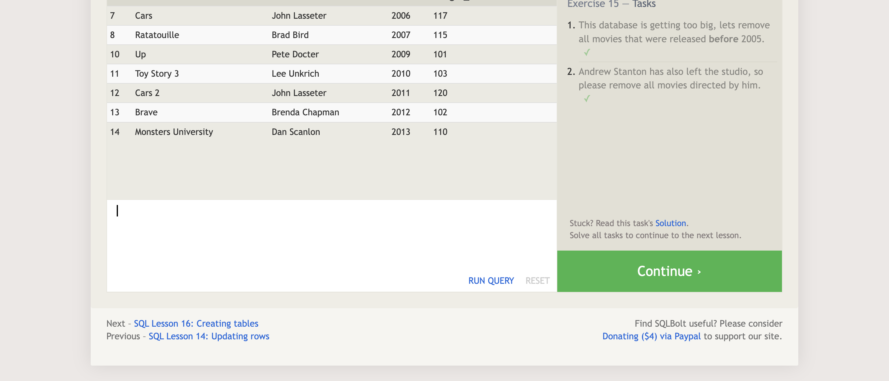

SQL is a language built for querying relational databases. It has built in commands that allow you to create, read, update, and delete databases table's rows and column. You can write query's to find information about the data in your database including information stored across multiple tables with select statements using join statements, aggregate functions, conditional statements and more.